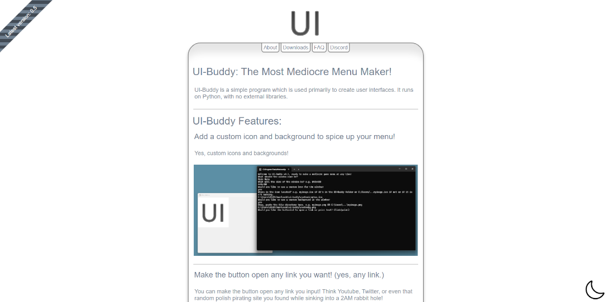
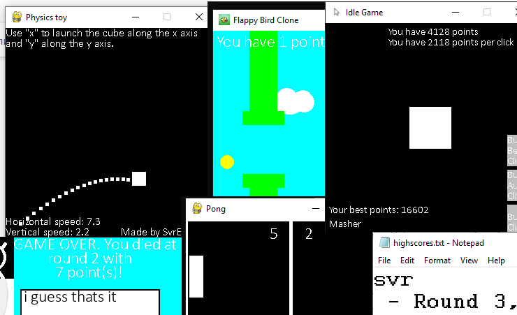

# Damage to the Brain that is Severe!
- 👋 Hi, I’m [**@svrbrndmg**](https://github.com/svrbrndmg)!
- 👀 I’m interested in *gamedev, coding and writing.*
- 🌱 I’m currently learning HTML/CSS/JS, but you likely won't see much of that here on Github. Before that I used to work in Python.
- 📫 How to reach me: [email me](mailto:svrbrndmg@proton.me), or DM @svrbrndmg on discord.
- 😄 Pronouns: he/him/any
- ✨ Projects:
     - ✔️ [Hardcore Idler](https://svrbrndmg.itch.io/hardcore-idler) - done. it's my first big game. please play it
     - ✔️ [Physics Toy](https://github.com/svrbrndmg/physics-toy) - probably won't add more onto it. it's fun enough even at this point. weee!
     - ✔️ [UI-Buddy Website](https://ui-buddy.github.io/UI-Buddy) - my first "good" website. In the style of Web 2.0, with a touch of modern fun.
     - ✔️ [Pong Clone](https://github.com/svrbrndmg/pong) - yeah, I don't really wanna add more to this. Or feel that I need to. It's a Pong clone.
     - ✔️ [mah blog](https://svrbrndmg.github.io) - I mean it wasn't really my code. Thanks to Chad Baldwin for the great template!
     - ✔️ dis readme - you're reading it.
     - ✔️ [really simple rps](https://github.com/svrbrndmg/really-simple-rps) - done. might help someone somewhere. maybe.
     - ✔️ waverand - why did I make this it is like 5 lines of code. (I'm not putting the link here as I'm probably gonna delete this lol)
     - ❌ [UI-Buddy](https://github.com/svrbrndmg/ui-buddy) - Not where I want it to be yet. Powerful in its own right, but not yet in 1.0. I'm just procrastinating this pretty much
     - ❌ [Toki Tori Website](https://svrbrndmg.neocities.org) - "Archival" project. Mostly done, but I can't find the goddamn quicktime movies someone please for the love of g-
     - ❌ [Flappy Bird Clone](https://github.com/svrbrndmg/flappy-bird)  - 5 more minutes please!!! I wanna add some more gameplay stuff, like collectible coins and the like.
     - ❔ ??? - some secret schtuff shhhh

## 
### Some images of my stuff:

Hardcore Idler (this wonderful logo by [CptFuzball](https://campsite.bio/cptfuzball)) | UI-Buddy Website |  Collage of various Github projects
:-------------------------:|:-------------------------:|:-------------------------:
  |   | 

### Click on an image to see it in full!
